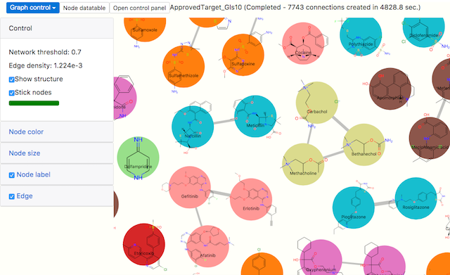

Kiwiii
================

Kiwiii is a web application package for chemical data analysis and visualization.

Datagrid module, which is mainly designed for drug candidate data profiling, has sortable smooth scroll table with chemical structure SVG data and plot columns. [Flashflood](https://github.com/mojaie/flashflood)  web server will help continuous data integration by offering workflow pipeline and parallel computation job scheduling via HTTP.

Network module offers a platform for network-based structure-activity relationship (SAR) analysis. This network consists of chemical structure similarity connections among each chemical entity nodes. General graph analysis methods are applied to the network to find meaningful relationship in the chemical space.

As the dataset specifications of them are based on JSON, many of available data resources on the internet can be easily imported for the integrated data analysis. The visualized analysis results can be exported to compressed JSON reversibly (also SDFile and Excel but irreversibly). Their fine portability also accelerates data exchange for collaborations.

Supported browsers
--------------------

- Google Chrome 57+
- Mozilla Firefox 50+

Try interactive data view examples (Observable)
------------------------------------------------

Features and demo applications
---------------------------------

### Datagrid view

[[Open datagrid app]](https://mojaie.github.io/kiwiii/app/datagrid.html)

### Test data files

- [DrugBank 5.0.5 FDA Approved](https://mojaie.github.io/kiwiii/assets/resources/DrugBank5.0.5_FDA_Approved.ndc)
- [SPR sensorgram plot table](https://mojaie.github.io/kiwiii/assets/resources/SPR_results_demo.ndc)

### Features
- [SlickGrid](https://github.com/mleibman/SlickGrid)-like smooth scroll datatable
- Sortable
- Row filter
- User input column (checkbox and comment)
- PNG, SVG image column (ex. chemical structure column)
- Plot column ([Vega version 3](https://vega.github.io/vega/) plot data)
- Chemical structure similarity network generation (requires [Flashflood](https://github.com/mojaie/flashflood) server)
- Export to SDFile and Excel (requires [Flashflood](https://github.com/mojaie/flashflood) server)

### Network view

[[Open network app]](https://mojaie.github.io/kiwiii/app/network.html)

### Test data files

- [DrugBank 5.0.5 FDA Approved](https://mojaie.github.io/kiwiii/assets/resources/DrugBank5.0.5_FDA_Approved_GLS08.gfc)

### Features

- Visualized network of chemical structure nodes connected with structure similarity relationship (known as [Chemical Space Network](https://doi.org/10.1007/s10822-014-9760-0))
- Force-directed layout implemented with d3-force
- Interactive zoom and drag
- Community detection ([jLouvain](https://github.com/upphiminn/jLouvain))

### Profile view

- An overview of the chemical data entry (chemical structure, properties, aliases and related assay results)
- requires [Flashflood](https://github.com/mojaie/flashflood) server

### Dashboard

[[Dashboard app]](https://mojaie.github.io/kiwiii/app/dashboard.html)

- Entry point of the application bundle
- Show list of stored local data, server jobs and status
- Open or delete stored datagrids and networks (You can save your data view into Indexed DB local storage by clicking "Save" on their menubar. Click "Reset local datastore" button to clean up it. Be careful not to leave confidential data on public access PC.)

API Documentation (WIP)
------------------------

https://mojaie.github.io/kiwiii/docs

License
--------------

[MIT license](http://opensource.org/licenses/MIT)

Copyright
--------------

(C) 2014-2018 Seiji Matsuoka
