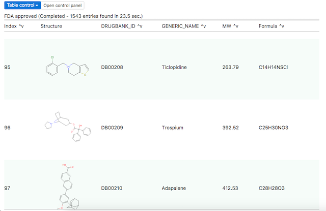
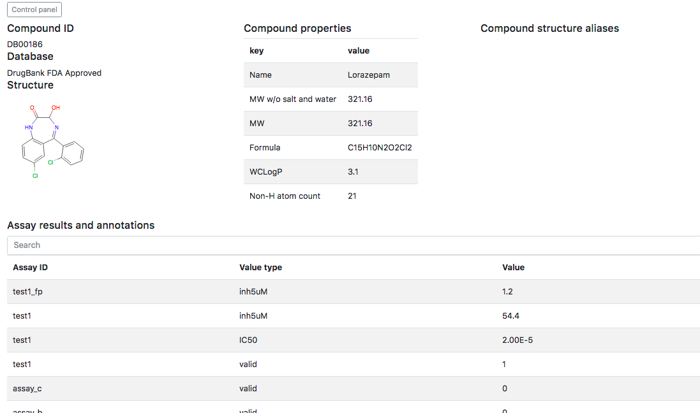
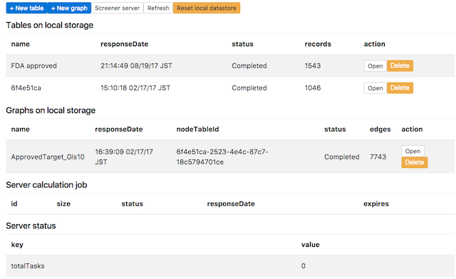
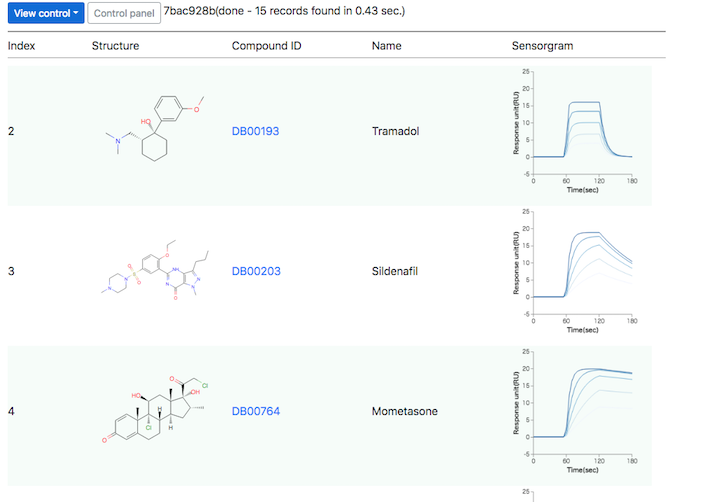

Kiwiii
================

Kiwiii is a web application package for chemical data analysis and visualization.

Datagrid module, which is mainly designed for drug candidate data profiling, has sortable smooth scroll table with chemical structure SVG data and plot columns. [Flashflood](https://github.com/mojaie/flashflood)  web server will help continuous data integration by offering workflow pipeline and parallel computation job scheduling via HTTP.

Network module offers a platform for network-based structure-activity relationship (SAR) analysis. This network consists of chemical structure similarity connections among each chemical entity nodes. General graph analysis methods are applied to the network to find unexpected relationship in the chemical space.

As the dataset specifications of them are based on JSON, many of available data resources on the internet can be easily imported for the integrated data analysis. The visualized analysis results can be exported to compressed JSON reversibly (also SDFile and Excel but irreversibly). Their fine portability also accelerates data exchange for collaborations.

Supported browsers
--------------------

- Google Chrome 57+
- Mozilla Firefox 50+

Try interactive data view examples (Bl.ocks)
---------------------------------------------

Screen shots
--------------

Web application demo
---------------------

- [Datagrid view (DrugBank Approved drugs)](https://mojaie.github.io/kiwiii/datagrid.html?location=resources/DrugBank5.0.5_FDA_Approved.ndc)

- [Datagrid view (SPR sensorgram plot table example)](https://mojaie.github.io/kiwiii/datagrid.html?location=resources/SPR_results_demo.ndc)

- [Network view (DrugBank Approved drugs)](https://mojaie.github.io/kiwiii/network.html?location=resources/DrugBank5.0.5_FDA_Approved_GLS08.gfc)

- [Control panel](https://mojaie.github.io/kiwiii/control.html)
  - You can save your data view into Indexed DB local storage by clicking "Save view" in the control menu. Control panel shows the list of dataset stored in the web browser. Click "Reset local datastore" button to clean up it. Be careful not to leave confidential data on public access PC.

If you already have a table data file (.ndc, .ndr) or a network data file(.gfc, .gfr), use the following link and then load the data.

- [Load new datagrid view](https://mojaie.github.io/kiwiii/datagrid.html)

- [Load new network view](https://mojaie.github.io/kiwiii/network.html)

Features
--------------

- Datagrid view
  - [SlickGrid](https://github.com/mleibman/SlickGrid)-like smooth scroll datatable
  - Sortable
  - Row filter
  - User input column (checkbox and comment)
  - PNG, SVG image column (ex. chemical structure column)
  - Plot column ([Vega version 3](https://vega.github.io/vega/) plot data)
  - Chemical structure similarity network generation (requires [Flashflood](https://github.com/mojaie/flashflood) server)
  - Export to SDFile and Excel (requires [Flashflood](https://github.com/mojaie/flashflood) server)
- Network view
  - Visualized network of chemical structure nodes connected with structure similarity relationship (known as [Chemical Space Network](https://doi.org/10.1007/s10822-014-9760-0))
  - Force-directed layout implemented with d3-force
  - Interactive zoom and drag
  - Community detection ([jLouvain](https://github.com/upphiminn/jLouvain))
- Profile view (requires [Flashflood](https://github.com/mojaie/flashflood) server)
  - An overview of the chemical data entry (chemical structure, properties, aliases and related assay results)
- Control panel

API Documentation (WIP)
------------------------

https://mojaie.github.io/kiwiii/docs

License
--------------

[MIT license](http://opensource.org/licenses/MIT)

Copyright
--------------

(C) 2014-2018 Seiji Matsuoka
